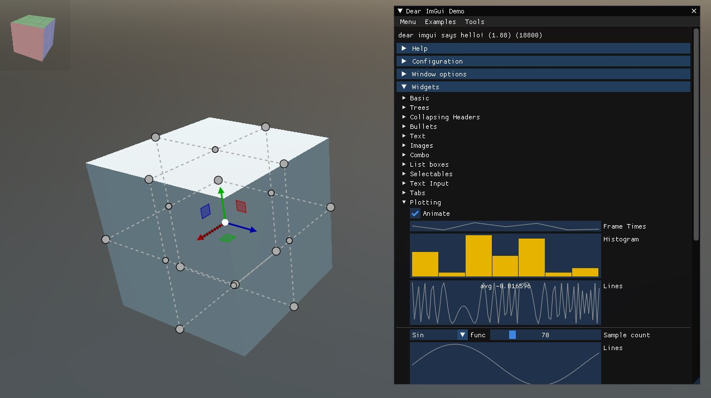
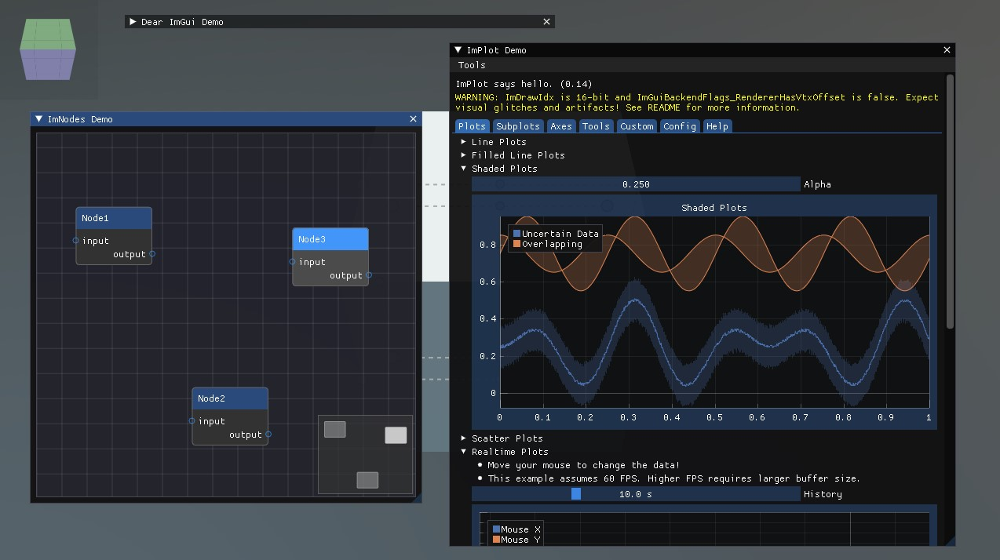

# ImGui and Extensions Demo

This sample shows how to use the ImGui extension in Evergine. The sample includes code for test the ImGui, ImPlot, ImGuizmo and ImNodes.

## Build and Run

- Required Visual Studio 2022 with.NET6 support

----
Powered by **[Evergine](http://www.evergine.com)**

LET'S CONNECT!

- [Youtube](https://www.youtube.com/subscription_center?add_user=EvergineChannel)
- [Twitter](https://twitter.com/EvergineTeam)
- [Blog](http://geeks.ms/evergineteam/)
